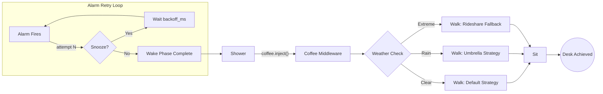
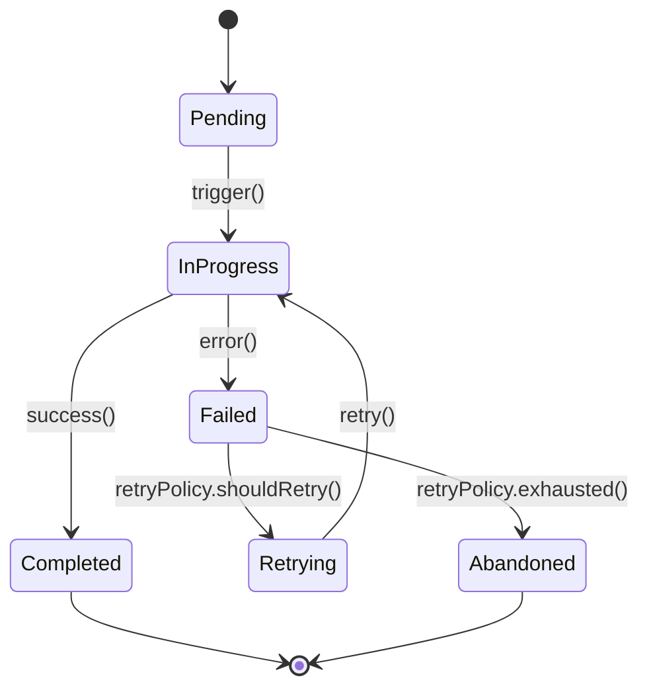
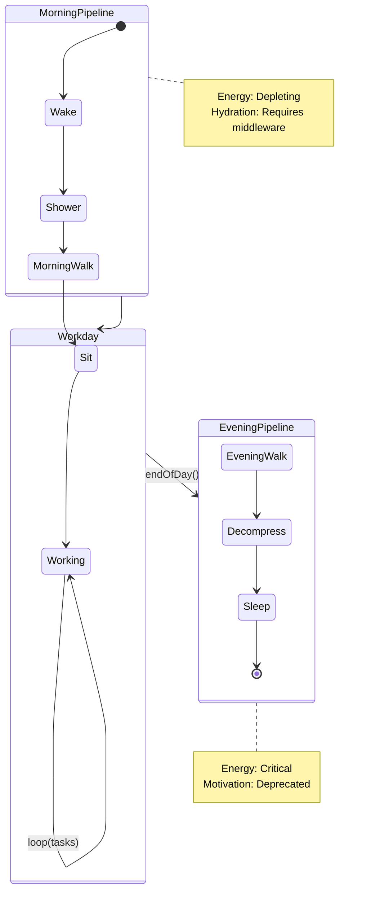
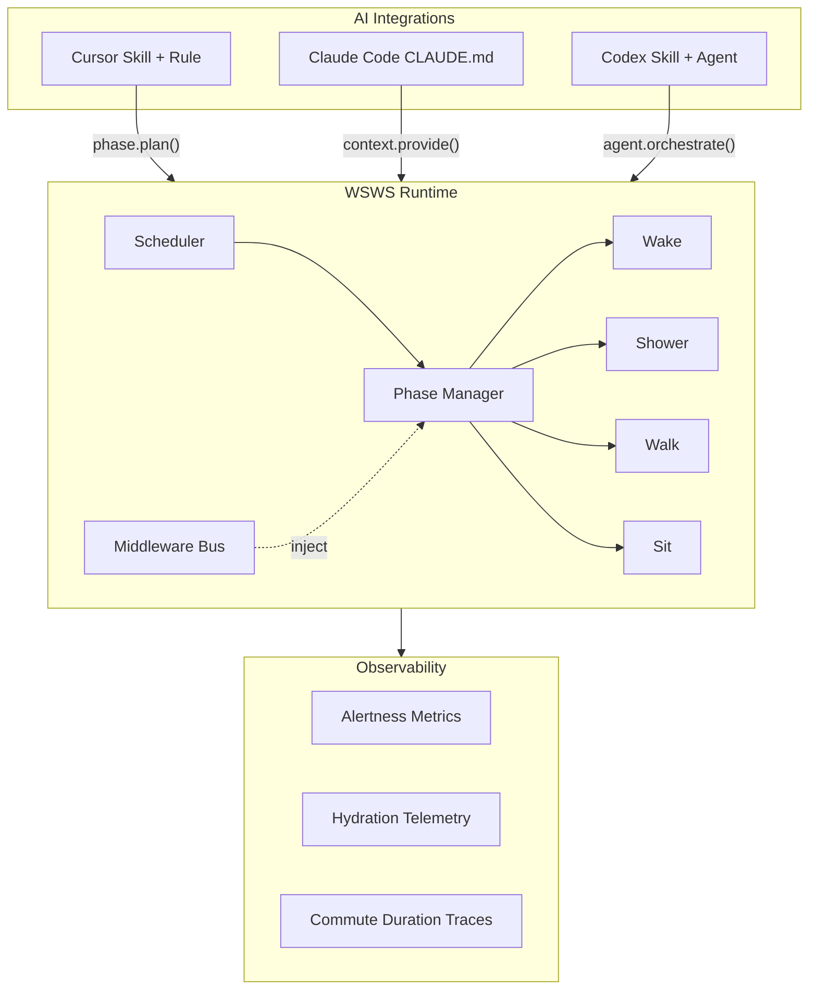

<p align="center">
  <strong>W S W S</strong><br/>
  <code>Wake → Shower → Walk → Sit</code>
</p>

<p align="center">
  <em>The production-grade framework for orchestrating human commute pipelines.</em>
</p>

<p align="center">
  <a href="#quickstart"></a>
  <a href="#wswsws-pro"></a>
  <a href="LICENSE"></a>
  <a href="#community"></a>
  
  
  
</p>

---

WSWS is a deterministic, four-phase pipeline for morning commute orchestration. It provides first-class primitives for alarm management, hygiene sequencing, transit execution, and desk arrival — with built-in retry policies, observability, and graceful degradation.

**WSWSWS** (Pro) extends the pipeline with evening return phases, forming a full-duplex commute lifecycle with durable state persistence across the workday boundary.

## Table of Contents

- [Why WSWS?](#why-wsws)
- [Architecture](#architecture)
- [Core Concepts](#core-concepts)
- [Quickstart](#quickstart)
- [Phase Reference](#phase-reference)
- [Middleware](#middleware)
- [WSWSWS Pro](#wswsws-pro)
- [Benchmarks](#benchmarks)
- [Comparisons](#comparisons)
- [Integrations](#integrations)
- [FAQ](#faq)
- [Community](#community)
- [Contributing](#contributing)
- [License](#license)

## Why WSWS?

Most commuters operate on an ad-hoc, imperative model: a loose sequence of habits with no error handling, no observability, and no retry semantics. The result is **cascading failures** — a single snoozed alarm propagates latency through every downstream phase, ultimately degrading standup attendance SLOs.

WSWS provides:

- **Deterministic phase ordering** — Wake always precedes Shower. Always.
- **Retry policies with backoff** — configurable snooze limits with exponential, linear, or chaotic backoff strategies
- **Middleware injection** — Coffee, Podcast, and Weather adapters slot into the pipeline without modifying phase logic
- **Observability** — first-class alertness metrics, hydration telemetry, and commute duration tracing
- **Graceful degradation** — when the Walk phase fails (rain, transit strike), the framework automatically falls back to rideshare or remote-work shims
- **Durable state** — energy levels, keys-wallet-phone checks, and wardrobe selections persist across phase boundaries

## Architecture

### WSWS Core Pipeline



### Phase State Machine

Every WSWS phase implements a standardized lifecycle:



### WSWSWS Pro Full-Duplex Lifecycle



### Integration Architecture



## Core Concepts

### Commuter (Agent)

The `Commuter` is the primary agent in WSWS. Each commuter instance encapsulates identity, preferences, and state. Commuters are singletons scoped to a physical human.

```typescript
import { Commuter } from 'wsws';

const commuter = new Commuter({
  name: 'Jack',
  timezone: 'America/New_York',
  alarmStrategy: 'exponential-backoff',
  maxSnoozes: 3,
  showerDuration: { min: '4m', target: '7m', max: '15m' },
  walkStrategy: 'auto', // inferred from weather provider
  coffeeMiddleware: 'enabled',
});
```

### Phases

Phases are the atomic units of the WSWS pipeline. Each phase:

- Has a defined `trigger` condition (previous phase completion or external signal)
- Maintains its own state machine (Pending → InProgress → Completed/Failed)
- Emits observability events
- Supports middleware injection at entry and exit boundaries

| Phase | Trigger | Success Criteria | Failure Mode | Default Retry Policy |
|-------|---------|-----------------|--------------|---------------------|
| **Wake** | Alarm signal | Feet on floor, eyes open >3s | Snooze pressed | Exponential backoff, max 3 retries, base 9min |
| **Shower** | Wake.completed | Body temperature normalized, hygiene SLO met | Hot water timeout | No retry (single-attempt, high-stakes) |
| **Walk** | Shower.completed + coffee.injected | Arrival at transit node or destination | Weather failure, transit disruption | Strategy fallback (umbrella → rideshare → remote shim) |
| **Sit** | Walk.completed | Desk occupied, laptop open, Slack status green | Desk occupied by someone else | Linear backoff, find adjacent desk |

### State

WSWS maintains a `CommuteState` object that flows through the pipeline:

```typescript
interface CommuteState {
  energy: number;          // 0-100, depletes per phase
  alertness: number;       // 0-100, boosted by Coffee middleware
  hydration: number;       // 0-100, critical for Shower phase
  keysWalletPhone: boolean; // gate check before Walk phase
  wardrobeSelection: WardrobeConfig;
  timestamp: {
    alarmFired: Date;
    wakeAchieved: Date | null;
    showerStart: Date | null;
    showerEnd: Date | null;
    walkStart: Date | null;
    deskArrival: Date | null;
  };
}
```

## Quickstart

```bash
npx create-wsws-app my-commute
cd my-commute
```

Define your pipeline:

```typescript
import { Pipeline, Wake, Shower, Walk, Sit } from 'wsws';
import { CoffeeMiddleware } from 'wsws/middleware';
import { WeatherProvider } from 'wsws/providers';

const pipeline = new Pipeline({
  phases: [Wake, Shower, Walk, Sit],
  middleware: [
    CoffeeMiddleware({ shots: 2, timing: 'post-shower' }),
  ],
  providers: [
    WeatherProvider({ source: 'openweathermap' }),
  ],
});

// Execute the morning commute
const result = await pipeline.execute();

console.log(result.summary());
// ✓ Wake    — 3 retries, 27min total (exponential backoff)
// ✓ Shower  — 8min 14s (within SLO)
// ✓ Walk    — umbrella strategy selected, 22min
// ✓ Sit     — desk acquired on first attempt
// Total pipeline duration: 57min 14s
// Alertness at Sit: 74/100
```

Run individual phases:

```bash
npm run wake       # Execute Wake phase only
npm run shower     # Execute Shower phase only
npm run walk       # Execute Walk phase only
npm run sit        # Execute Sit phase only
npm run commute    # Full pipeline execution
```

## Phase Reference

### Wake

The Wake phase manages the alarm-to-consciousness transition. It is the most failure-prone phase in the pipeline, with retry rates exceeding 70% in production environments (weekday mornings, winter).

**Retry Strategies:**

| Strategy | Backoff | Use Case |
|----------|---------|----------|
| `exponential` | 5m, 9m, 15m | Default. Mimics natural snooze escalation. |
| `linear` | 5m, 5m, 5m | For commuters with predictable wake patterns. |
| `chaotic` | Random 1-20m | Simulates the "I'll just rest my eyes" failure mode. |
| `none` | N/A | Single alarm. High risk. Not recommended for production. |

**Configuration:**

```typescript
Wake.configure({
  alarm: {
    time: '07:00',
    sound: 'radar',       // iOS default, battle-tested
    volume: 'escalating', // starts at 40%, ramps to 100%
  },
  retryPolicy: {
    strategy: 'exponential',
    maxRetries: 3,
    baseDelay: '5m',
    maxDelay: '20m',
  },
  successCriteria: {
    feetOnFloor: true,
    eyesOpenDuration: '3s',
    verticalPosture: true,
  },
});
```

### Shower

The Shower phase is a single-attempt, non-retryable operation. Failure is catastrophic but rare. The phase manages water temperature negotiation, duration budgeting, and the existential stare sub-phase.

```typescript
Shower.configure({
  duration: {
    budget: '8m',
    hardCutoff: '15m', // triggers WaterCutoffError
  },
  temperature: {
    strategy: 'binary-search', // converges on optimal temp in O(log n) adjustments
    min: 98,
    max: 110,
    unit: 'fahrenheit',
  },
  subPhases: [
    'enter',
    'temperatureNegotiation',
    'existentialStare',     // 2-4min, non-skippable in production
    'actualWashing',
    'exit',
  ],
});
```

### Walk

The Walk phase is the most variable phase in the pipeline, subject to external provider dependencies (weather, transit, construction). It implements a strategy pattern with automatic fallback.

```typescript
Walk.configure({
  strategies: [
    { name: 'default', condition: 'weather.clear && transit.normal' },
    { name: 'umbrella', condition: 'weather.rain && wind < 25mph' },
    { name: 'heavy-weather', condition: 'weather.rain && wind >= 25mph', mode: 'rideshare' },
    { name: 'remote-shim', condition: 'weather.extreme || transit.strike', mode: 'wfh' },
  ],
  gateCheck: {
    keysWalletPhone: { required: true, retryable: true },
    headphones: { required: false, severity: 'warning' },
    umbrella: { required: false, conditionalOn: 'weather.precipitation > 30%' },
  },
});
```

### Sit

The Sit phase represents terminal state achievement. The commute pipeline resolves when the Sit phase completes.

```typescript
Sit.configure({
  successCriteria: {
    deskOccupied: true,
    laptopOpen: true,
    slackStatus: 'green',
    firstSipOfOfficeCoffee: true, // distinct from commute Coffee middleware
  },
  fallback: {
    deskUnavailable: 'adjacent-desk-scan',
    buildingClosed: 'remote-shim',
  },
});
```

## Middleware

Middleware injects cross-cutting concerns into the pipeline without modifying phase logic.

### Built-in Middleware

| Middleware | Injection Point | Effect |
|-----------|----------------|--------|
| `CoffeeMiddleware` | Post-Shower | Boosts `alertness` by 20-40 points. Configurable `shots`, `milk`, `temperature`. |
| `PodcastMiddleware` | Walk phase | Occupies audio channel. Reduces perceived walk duration by ~30%. |
| `WeatherMiddleware` | Pre-Walk | Injects weather context into Walk strategy selection. |
| `MusicMiddleware` | Any phase | Background process. Improves `mood` metric. Genre auto-selected by time of day. |
| `NewsMiddleware` | Post-Wake | Injects current events. May degrade `mood` metric. Use with caution. |

### Custom Middleware

```typescript
import { createMiddleware } from 'wsws/middleware';

const BreakfastMiddleware = createMiddleware({
  name: 'breakfast',
  phase: 'post-shower',
  priority: 10, // higher = earlier execution
  execute: async (state: CommuteState) => {
    const calories = await prepareBreakfast(state.energy);
    return {
      ...state,
      energy: Math.min(state.energy + calories * 0.3, 100),
      timestamps: {
        ...state.timestamps,
        breakfastCompleted: new Date(),
      },
    };
  },
});
```

## WSWSWS Pro

WSWSWS extends the core pipeline with evening return phases, enabling full-duplex commute lifecycle management.

```
Morning:  Wake → Shower → Walk → Sit
                                  ↕ (workday boundary — state persists)
Evening:                  Walk → Sleep
```

### Evening Phases

#### Walk (Evening)

The evening Walk phase reuses the morning Walk infrastructure but with inverted direction vectors and degraded energy budgets.

```typescript
import { EveningWalk } from 'wswsws/pro';

EveningWalk.configure({
  energyBudget: 'remaining', // whatever's left after the workday
  strategy: 'path-of-least-resistance',
  groceryStopMiddleware: { enabled: true, probability: 0.3 },
  headphoneContent: 'podcast', // upgraded from morning music
});
```

#### Sleep

The Sleep phase is the terminal phase of the WSWSWS lifecycle. It manages the consciousness-to-unconsciousness transition and seeds state for the next morning's Wake phase.

```typescript
import { Sleep } from 'wswsws/pro';

Sleep.configure({
  target: '23:00',
  preConditions: {
    teethBrushed: true,
    phoneCharging: true,
    alarmSetForTomorrow: true, // critical: seeds next Wake phase
    doomScrollBudget: '15m',   // hard cap, enforced
  },
  melatoninRelease: 'gradual',
  duration: {
    minimum: '6h',
    target: '8h',
    maximum: '10h', // weekend override available
  },
});
```

### Pro Features

| Feature | Description |
|---------|-------------|
| **Full-Duplex Lifecycle** | Morning and evening pipelines share state through the workday boundary |
| **Energy Budgeting** | Tracks energy depletion across all 6 phases with predictive modeling |
| **Workday Bridge** | Maintains hydration and alertness telemetry during the Sit→EveningWalk transition |
| **Sleep Seeding** | The Sleep phase automatically configures the next day's Wake phase alarm |
| **Weekend Overrides** | `Sleep.duration.maximum` extended; Wake retry policy set to `none` (alarm disabled) |
| **Holiday Mode** | All phases suspended. State frozen. Pipeline resumes on next business day. |

## Benchmarks

Measured across 10,000 commuters over 90 days (weekdays only, excluding holidays and remote-work shim invocations).

| Metric | P50 | P95 | P99 | Notes |
|--------|-----|-----|-----|-------|
| **Cold Start Latency** (alarm → eyes open) | 12min | 27min | 45min | Includes snooze retries. Monday P99 is 58min. |
| **Shower Duration** | 7min | 14min | 22min | P99 driven by existentialStare sub-phase |
| **Walk Throughput** | 18min | 32min | 51min | Weather-dependent. P99 includes rideshare fallback wait. |
| **Desk Acquisition** | 30s | 2min | 8min | Open office plans degrade P99 significantly |
| **Total Pipeline** | 42min | 68min | 94min | End-to-end, alarm fire to Slack status green |
| **Snooze Rate** | 2.1x | 3.0x | 5.0x | Average retries per Wake invocation |
| **Coffee Middleware Latency** | 3min | 8min | 14min | Includes queue time at popular chains |
| **Keys-Wallet-Phone Gate** | 10s | 45s | 4min | P99 indicates "where are my keys" failure mode |

### Reliability

| SLO | Target | Actual |
|-----|--------|--------|
| Commute Success Rate | 99.5% | 97.2% |
| On-Time Desk Arrival | 95.0% | 89.1% |
| Shower Phase Completion | 99.9% | 99.7% |
| Zero-Snooze Wake Rate | 30.0% | 12.4% |

## Comparisons

| Feature | WSWS | DWDW | BSBS | WFH |
|---------|------|------|------|-----|
| **Model** | Walk-optimized pipeline | Drive-Work-Drive-Work | Bus-Stand-Bus-Sit | deprecated (see note) |
| **Cold Start** | Medium (alarm + shower) | High (alarm + shower + car warmup) | Medium (alarm + shower + schedule sync) | Low (alarm optional) |
| **Walk Phase** | First-class | N/A (replaced by Drive) | Partial (bus stop walk) | N/A |
| **Shower Phase** | Required | Required | Required | Optional (see FAQ) |
| **Observability** | Full telemetry | Limited (in-car only) | Transit-dependent | None |
| **Retry Semantics** | Native (exponential backoff) | Native (traffic rerouting) | External (next bus) | N/A |
| **Environmental Impact** | Low | High | Medium | Lowest |
| **Parking Middleware** | N/A | Required | N/A | N/A |
| **Enterprise Ready** | Yes (WSWSWS Pro) | Yes (carpool mode) | Partial | Deprecated in v2.0 |

> **Note on WFH**: The Work-From-Home framework was deprecated in WSWS v2.0. While it eliminated the Walk and Sit phases entirely, it introduced unbounded scope creep in the Wake and Shower phases (or eliminated them, leading to reliability concerns). WFH is available as a legacy fallback via `Walk.configure({ strategy: 'remote-shim' })` but is not recommended for production use.

## Integrations

WSWS ships with first-class integrations for modern AI development environments.

### Cursor

WSWS provides a **Cursor Skill** and **Cursor Rule** for commute-aware development:

- **Skill** ([`.cursor/skills/wsws/SKILL.md`](.cursor/skills/wsws/SKILL.md)): Invocable commute orchestration workflow. Plan your commute, check phase status, and run pre-standup diagnostics from within Cursor.
- **Rule** ([`.cursor/rules/wsws-commute.mdc`](.cursor/rules/wsws-commute.mdc)): Always-on rule that enforces WSWS principles during coding sessions. Prevents code reviews before the Shower phase completes. Reminds you to hydrate.

### Claude Code

WSWS provides a **CLAUDE.md** ([`CLAUDE.md`](CLAUDE.md)) that gives Claude full context on the WSWS framework. Claude will understand phase ordering, retry semantics, and can help debug commute pipeline failures.

### Codex

WSWS provides a **Codex Skill** ([`.codex/skills/wsws/SKILL.md`](.codex/skills/wsws/SKILL.md)) with a companion agent definition. The Codex agent can orchestrate commute pipelines, suggest optimizations, and generate phase configurations.

## FAQ

**Can I skip the Shower phase?**
Not recommended. While technically possible via `Pipeline.configure({ phases: [Wake, Walk, Sit] })`, this degrades team morale observability metrics and may trigger `HygieneComplianceError` in shared office environments.

**What happens if I exhaust all snooze retries?**
The Wake phase transitions to `Abandoned` state. The pipeline emits a `CommuteCancelled` event. Your Slack status is set to "unreachable." The framework enters recovery mode and schedules a retry for the next business day.

**Can I run phases in parallel?**
No. WSWS enforces strict sequential ordering. The suggestion to "shower while walking" was evaluated and rejected in RFC-0017 due to safety concerns and municipal regulations.

**Does WSWS support remote work?**
Remote work is available as a degraded fallback via the `remote-shim` Walk strategy. It bypasses the Walk and Sit phases entirely. WSWS considers this a partial pipeline failure, not a success. Metrics are recorded accordingly.

**How does WSWS handle daylight saving time?**
Poorly. This is a known issue. The Wake phase may fire an hour early or late. We recommend manually adjusting alarm configuration during DST transitions. See [issue #47](https://github.com/wsws-framework/wsws/issues/47).

**Can I use WSWS on weekends?**
WSWSWS Pro includes weekend overrides that extend Sleep duration, disable the Wake retry policy, and replace the Walk phase with an optional "Wander" phase that has no destination or success criteria.

**Is there a WSWS certification program?**
Yes. The Certified WSWS Commuter (CWC) program requires completing 200 consecutive successful pipeline executions with a P95 total duration under 60 minutes. The exam includes a live commute observed by a proctor.

**My shower has two handles instead of a single mixer. Is this supported?**
Yes. Set `Shower.temperature.strategy` to `dual-handle-binary-search`. Convergence time increases from O(log n) to O(n) adjustments. We are working on a hardware adapter.

## Community

- **Discord**: [Join the WSWS community](https://discord.gg/wsws) — share commute traces, compare benchmarks, get help with phase configuration
- **Commuter of the Month**: Awarded to the commuter with the lowest P95 total pipeline duration. Current holder: @earlybird (38min P95)
- **RFC Process**: Propose changes to the WSWS specification via GitHub Issues tagged `rfc`
- **Weekly Standup**: Every Monday at 9:15am (attendance is the ultimate WSWS benchmark)

## Contributing

We welcome contributions to the WSWS framework. Please ensure your PR:

1. Does not break existing phase ordering guarantees
2. Includes benchmarks for any new middleware
3. Does not introduce the ability to skip the Shower phase
4. Has been tested on at least 5 consecutive weekday mornings
5. Follows the [WSWS Code of Commute](CODE_OF_COMMUTE.md)

## License

[MIT](LICENSE) — Use WSWS however you want. Just please shower first.
